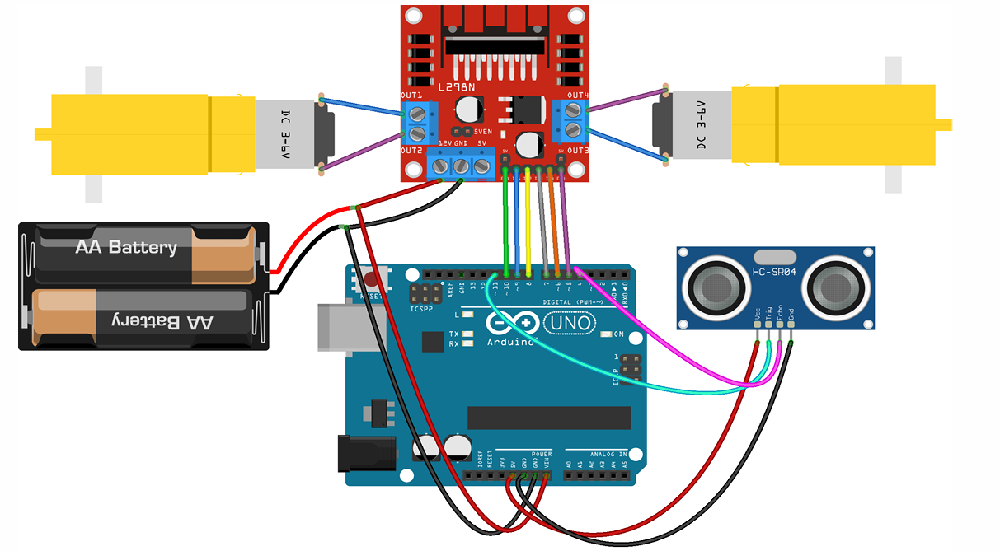

# Obstacle Avoiding Robot

Arduino code for controlling a robot with motor drivers, and an ultrasonic sensor for obstacle detection.

## Description

The robot has functions for moving forward, backward, turning left, turning right, and stopping. Additionally, it uses an ultrasonic sensor to detect obstacles and avoid collisions.

## Hardware Requirements

- Arduino board (Uno)
- Motor driver module (L298N)
- DC Motors
- Ultrasonic sensor (HC-SR04)

## Obstacle Avoidance

The robot uses an ultrasonic sensor to detect obstacles in its path. If an obstacle is detected within 20 cm, the robot will stop, move backward, and then turn right to avoid the obstacle.

## Circuit

